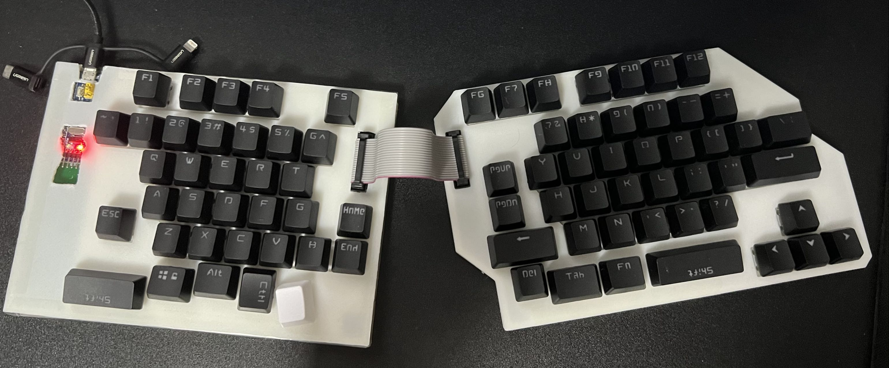

# MyKeyboard

* 该键盘是我为了更快地敲代码而给自己设计
* 本方案借鉴了如下两个项目:
  - https://github.com/SEASKY-Master/keyboard
  - https://github.com/diabolo38/HidKbd
* 本方案中的原理图是用立创EDA设计的
* RightControl键被设计用来切换键层
  - 一层为正常键盘
  - 二层用F1~F4实现多媒体键
  - 最初设计不支持切换层, 用RightControl作为切换键的话会和Ctrl+-快捷键冲突, 先取消这个功能了, 可以在代码里添加宏WITH_MULTIMEDIA_KEY来启用.
* 成品图
  

* 成本：
  - STM32F103最小系统板，20
  - PCB板，都是5块板，无铅喷锡，包括快递费：左半边110，右半边130。平均一个键盘48
  - N4148贴片二极管，大概5.6
  - 可插拔轴座，35
  - JTAG插头和排线，3.1
  - 键盘轴，3块一个，大概220
  - 键帽，15
  - 3D打印定位板和外壳，估计100g材料，7块钱
  - 共计350左右
